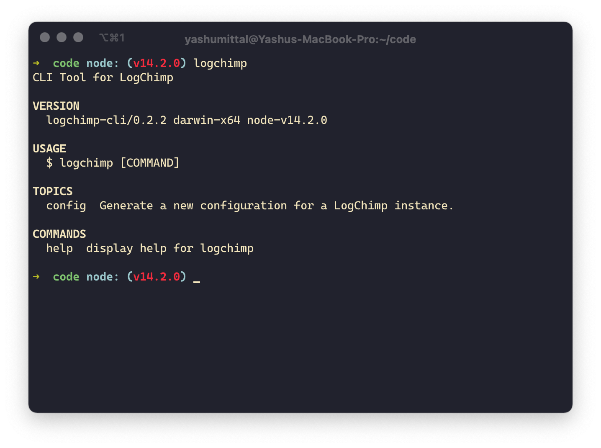

<h1 align="center">
  LogChimp CLI
</h1>

  
  
  
  

<h3 align="center">
  <a href="https://logchimp.codecarrot.net/docs/install/cli/">Docs</a>
   · 
  <a href="./CONTRIBUTING.md">Contribute</a>
   · 
  <a href="https://twitter.com/logchimp">Twitter</a>
   · 
  <a href="https://discord.gg/A7mztcC">Discord</a>
</h3>

	

**NOTE:** You can look for [alternatives ways to deploy LogChimp](https://logchimp.codecarrot.net/docs/install).

## Project Goals

The objective of the LogChimp CLI is to setting up and maintaining a LogChimp site as easily as possible.

LogChimp CLI is aimed at people who are comfortable in a command-line environment, and therefore some technical knowledge is assumed.

Read the [setup guide](https://logchimp.codecarrot.net/docs/install/) to learn other ways of setting up a LogChimp site.

### Recommended Stack

We officially recommend the following stack for production installs.

- Ubuntu 16.04 or Ubuntu 18.04
- NGINX
- Node.js 12
- PostgreSQL 10 or 12
- Systemd

Our primary focus is only to support this stack, to ensure that everyone that uses this stack can set up their LogChimp site. As with every additional option for configuration or additional environment creates exponential complexities and maintenance overhead.
